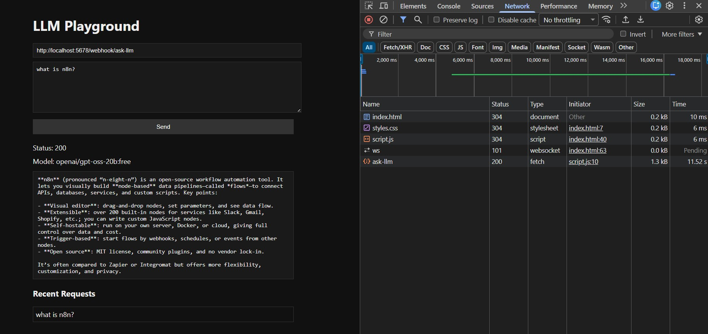
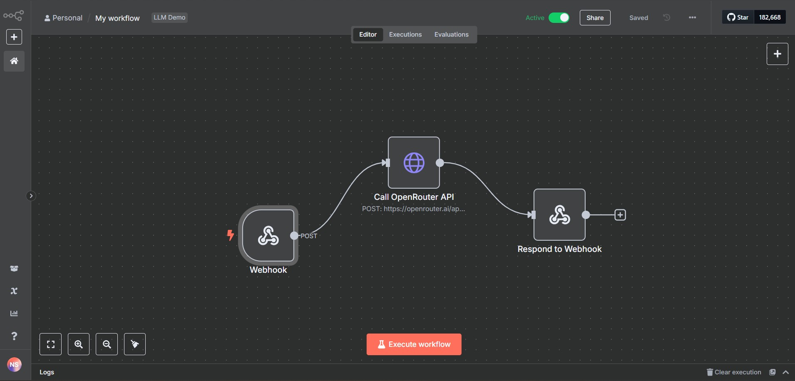
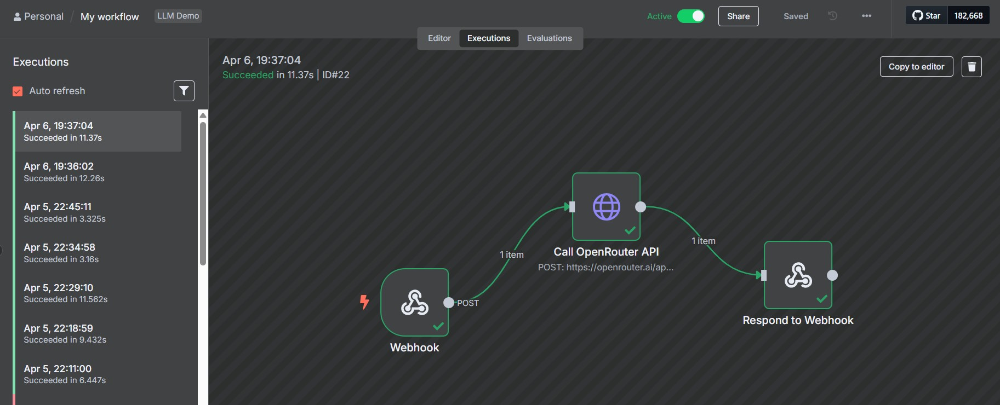
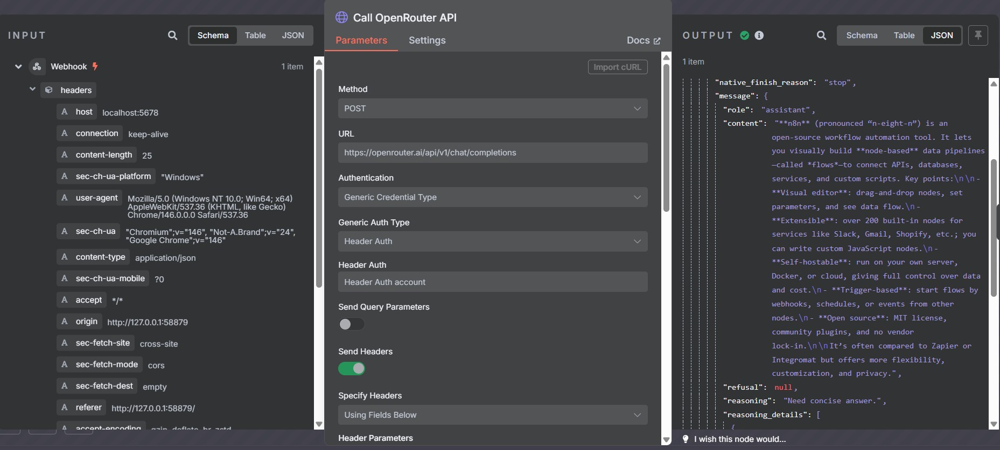

# n8n LLM Workflow Integration

> A decoupled, production-ready pipeline connecting a low-code automation engine to large language model inference — built with **n8n**, **OpenRouter**, and a lightweight JavaScript frontend.

---

## Table of Contents

- [Overview](#overview)
- [Architecture](#architecture)
- [Technical Stack](#technical-stack)
- [Project Structure](#project-structure)
- [Setup & Installation](#setup--installation)
- [Configuration](#configuration)
- [Usage](#usage)
- [Screenshots](#screenshots)
- [Conclusion](#conclusion)

---

## Overview

This project demonstrates a clean separation of concerns in an AI-driven application. Rather than embedding LLM logic directly in application code, **n8n** acts as the API gateway and orchestration layer — handling authentication, request routing, and response sanitization. The frontend communicates with n8n via webhook, keeping the client thin and the backend flexible.

**Key design goals:**

- Secure credential management via n8n's native credential store
- Minimal, dependency-free frontend for broad compatibility
- Easily swappable model layer through OpenRouter's unified API

---

## Architecture

```
┌─────────────────┐        HTTP POST         ┌──────────────────────┐
│                 │  ──────────────────────►  │                      │
│  Frontend (UI)  │      { "prompt": "..." }  │   n8n Webhook Node   │
│                 │  ◄──────────────────────  │                      │
└─────────────────┘      JSON Response        └──────────┬───────────┘
                                                         │
                                                         ▼
                                              ┌──────────────────────┐
                                              │  HTTP Request Node   │
                                              │  (OpenRouter API)    │
                                              └──────────┬───────────┘
                                                         │
                                                         ▼
                                              ┌──────────────────────┐
                                              │ Respond to Webhook   │
                                              │ (Sanitized Output)   │
                                              └──────────────────────┘
```

The workflow is encapsulated in three primary n8n nodes:

| Node | Role |
|---|---|
| **Webhook Node** | Listens for HTTP POST requests; extracts the `prompt` field from the JSON payload |
| **HTTP Request Node** | Authenticates and forwards the prompt to the OpenRouter API |
| **Respond to Webhook Node** | Processes the LLM response and returns a sanitized JSON object to the client |

---

## Technical Stack

| Layer | Technology |
|---|---|
| Orchestration | [n8n](https://n8n.io) |
| Inference Gateway | [OpenRouter API](https://openrouter.ai) |
| Language Model | `gpt-oss-20b` (Free Tier) |
| Frontend | HTML5 · CSS3 · Vanilla JavaScript |

---

## Project Structure

```
n8n-llm-workflow/
├── frontend/
│   ├── index.html          # Main UI entry point
│   ├── script.js           # Webhook communication logic
│   └── style.css           # Styles
├── workflow/
│   └── n8n-workflow.json   # Importable n8n workflow definition
├── screenshots/
│   ├── UI_with_Output.jpg                  # Frontend UI with a live LLM response
│   ├── n8n_llm_response_output.jpg         # LLM response as seen in n8n
│   ├── n8n_workflow.jpg                    # Full workflow graph in the n8n editor
│   └── n8n_workflow_execution_success.jpg  # Successful workflow execution log
└── README.md
```

---

## Setup & Installation

### 1. Install and Start n8n

```bash
npm install -g n8n
npx n8n start
```

n8n will be available at `http://localhost:5678` by default.

### 2. Import the Workflow

1. Open the n8n editor at `http://localhost:5678`
2. Navigate to **Workflows → Import from File**
3. Select `workflow/n8n-workflow.json`

---

## Configuration

### API Credential Setup

1. Generate an API key at [openrouter.ai](https://openrouter.ai)
2. In n8n, open the imported workflow and select the **HTTP Request Node**
3. Under **Authentication**, choose **Header Auth** and create a new credential:

```
Name:  Authorization
Value: Bearer <YOUR_OPENROUTER_KEY>
```

> **Note:** Ensure there is exactly one space between `Bearer` and your key.

4. Save the credential and confirm the node is configured to use it
5. Activate the workflow using the toggle in the top-right corner of the editor

### Frontend Endpoint

Open `frontend/script.js` and verify the webhook URL matches your active n8n endpoint:

```js
// Example — update to match your environment
const WEBHOOK_URL = "http://localhost:5678/webhook/ask-llm";
```

---

## Usage

There are two ways to interact with the workflow — through the frontend UI or directly via the command line.

### Webhook URLs

n8n exposes two webhook endpoints depending on your context:

| Mode | URL | When to use |
|---|---|---|
| **Production** | `http://localhost:5678/webhook/ask-llm` | Workflow is active (toggle enabled) |
| **Test** | `http://localhost:5678/webhook-test/ask-llm` | Testing inside the n8n editor |

> Make sure the URL in `frontend/script.js` matches whichever mode you're running.

---

### Option 1 — Frontend UI

Clone or download the repository, then open `frontend/index.html` directly in any modern browser — no server required. Type a prompt and hit submit; the LLM response will appear inline on the page.

```
frontend/
├── index.html   ← open this in your browser
├── script.js
└── style.css
```



---

### Option 2 — Command Line

To test the endpoint directly without the UI:

**PowerShell**
```powershell
Invoke-RestMethod -Uri "http://localhost:5678/webhook/ask-llm" `
  -Method Post `
  -ContentType "application/json" `
  -Body '{"prompt":"Explain the concept of backpropagation."}'
```

**curl**
```bash
curl -X POST http://localhost:5678/webhook/ask-llm \
  -H "Content-Type: application/json" \
  -d '{"prompt":"Explain the concept of backpropagation."}'
```

> Swap `webhook` for `webhook-test` in the URL if you're running a test execution inside n8n.

---

## Screenshots

| | |
|---|---|
|  |  |
| n8n workflow graph | Successful execution log |
|  |  |
| LLM response inside n8n | Frontend UI with response |

---

## Conclusion

This project serves as a blueprint for integrating LLM capabilities into automation workflows without coupling inference logic to application code. n8n's visual workflow editor and native credential management make it straightforward to extend — swap models, add preprocessing steps, or chain additional API calls — all without touching the frontend.
